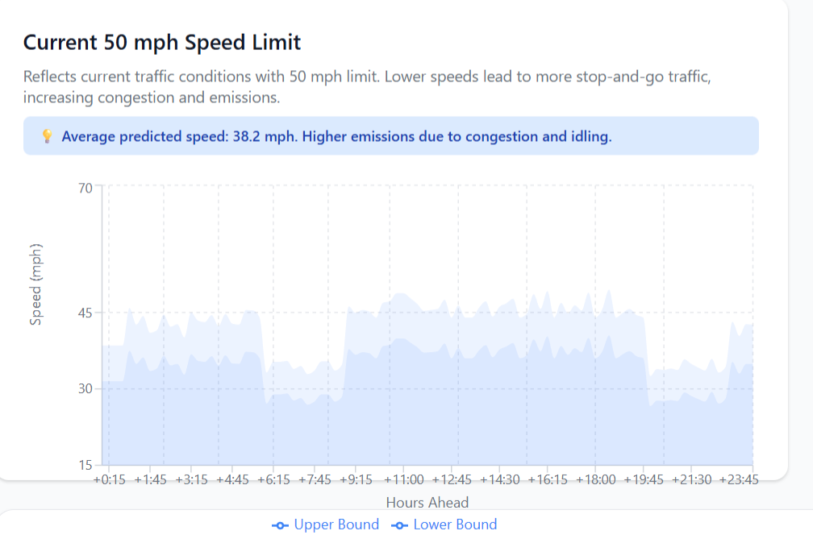

# Urban Futures LEAP - Freight Tax Climate Impact Tool

A web app that models how a freight tax on the Cross-Bronx Expressway impacts air quality and health outcomes in Soundview, the Bronx.
https://sriyathotakura.github.io/Scroll/

## What it does

The tool lets you adjust a tax amount ($0-$100) and instantly see:
- How many trucks get diverted daily
- PM2.5 reduction and health benefit value
- CO₂ savings
- An interactive map of the affected area

The model uses economic elasticity (how truck companies respond to taxes) to estimate emissions reductions, then calculates health and economic impacts.





## Tech Stack

**Backend**: FastAPI + Python  
**Frontend**: React + Leaflet  
**Data**: Socrata Open Data API (NYC health data)

## Setup

### Backend
```bash
cd backend
python -m venv venv
source venv/bin/activate  # or venv\Scripts\activate on Windows
pip install -r requirements.txt
python main.py
```
Runs on `http://localhost:8000`

### Frontend
```bash
cd frontend
npm install
npm start
```
Runs on `http://localhost:3000`

## Endpoints

- `POST /simulate` - Calculate impacts for a given tax amount
- `GET /baseline` - Current air quality and health baseline
- `GET /assumptions` - Model parameters and limitations
- `GET /geojson/soundview` - Map data

## Model Details

**Elasticity**: -0.4 (based on freight transport studies)  
**PM2.5 Impact**: 0.12 µg/m³ per 1,000 trucks removed  
**Health Value**: $6,000 per ton of PM2.5 reduction (EPA estimate)  

See `API_SPECIFICATION.md` for full details.

## Data Sources

- NYC Health Department (Socrata Open Data)
- EPA air quality guidelines
- Transportation elasticity studies
4. **Create scenario modeling** for alternative interventions
5. **Build community engagement dashboard** for feedback collection
6. **Add PDF export** for policy reports

---

# Sources/Datasets
- https://a816-dohbesp.nyc.gov/IndicatorPublic/data-explorer/climate/?id=2143#display=trend
- https://data.cityofnewyork.us/Transportation/DOT-Traffic-Speeds-NBE/i4gi-tjb9/about_data
- https://data.cityofnewyork.us/City-Government/LION/2v4z-66xt/about_data
- https://a816-dohbesp.nyc.gov/IndicatorPublic/data-features/hvi/
- https://data.cityofnewyork.us/Transportation/New-York-City-Truck-Routes-Map-/wnu3-egq7
- https://a816-dohbesp.nyc.gov/IndicatorPublic/data-explorer/asthma/?id=2414#display=map
- https://gisportalny.dot.ny.gov/portalny/apps/webappviewer/index.html?id=28537cbc8b5941e19cf8e959b16797b4

**Version**: 1.0.0  
**Last Updated**: January 2026  
**Status**: Production Ready for Hackathon

